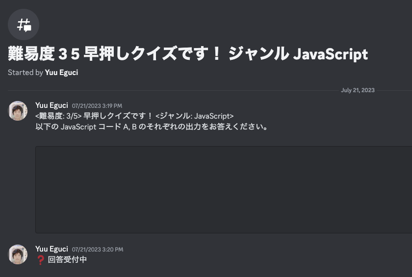

Vision API Python Sandbox
===

😎 Python 3.10 + Google Vision API

## How to Play?

こういう画像を用意しておいて……



```bash
# こんなふうに実行していく……
$ pipenv run python main.py

# こんなふうに、どの画像を使うか聞いてくれる……
[?] 選んでね: 難易度3のJavaScript早押しクイズ.png
 > 難易度3のJavaScript早押しクイズ.png
   色見本.png
   銀河鉄道の夜縦書き.png

# 選ぶと、 Google Cloud Vision AI に投げて、返却値を整形してくれるよ。
>>>> block 0
    >>>> paragraph 0
         # (32, 38) (69, 39) (69, 62) (32, 61)
    >>>> paragraph 1
         難易 度 35 早 押し クイズ です ! ジャンル JavaScript (16, 88) (749, 93) (749, 127) (16, 122)
    >>>> paragraph 2
         Started by Yuu Eguci (15, 141) (159, 141) (159, 155) (15, 155)
>>>> block 1
    >>>> paragraph 0
         Yuu Eguci 07/21/2023 3:19 PM (72, 208) (247, 208) (247, 220) (72, 220)
    >>>> paragraph 1
         < 難易 度 : 3/5 > 早 押し クイズ です ! < ジャンル : JavaScript > (71, 228) (476, 228) (476, 243) (71, 243)
    >>>> paragraph 2
         以下 の JavaScript コード A , B の それぞれ の 出力 を お答え ください 。 (72, 250) (542, 250) (542, 265) (72, 265)
>>>> block 2
    >>>> paragraph 0
         Yuu Eguci 07/21/2023 3:20 PM (71, 501) (250, 501) (250, 512) (71, 512)
    >>>> paragraph 1
         ? 回答 受付 中 (76, 521) (175, 521) (175, 536) (76, 536)
>>>> block 3
    >>>> paragraph 0
         July 21 , 2023 (694, 177) (761, 177) (761, 187) (694, 187)
```

## API コールの履歴を見たい

ここにアクセスしようや。

https://console.cloud.google.com/apis/dashboard

API ごとに見たいときはこっちね。こっちっていうか上のとこ↑から潜れる。

https://console.cloud.google.com/apis/api/vision.googleapis.com/metrics

## 下準備が必要

Cloud Vision API を使うには、 Google Cloud Console で "プロジェクト" をいっこ作る必要がある。

**(MEMO for me) すでに自分用のプロジェクトは作ってあって、 Vision API は念のため無効化してある状態。**

1. https://console.cloud.google.com/welcome
2. 新しいプロジェクト
3. API とサービス > ライブラリ > Cloud Vision API を有効にする
4. API とサービス > 認証情報 > サービスアカウントを管理 > サービスアカウントを作成
    - Python から Vision API を使うだけなら、サービスアカウントは、 Vision API に対する最小限のアクセス権限だけを持てばよい
5. サービスアカウントをクリック > キータブ > 鍵を追加 > JSON が手に入る
6. .env 登録
    - `GOOGLE_APPLICATION_CREDENTIALS=./vision-api-python-sandbox-....json`

これで使えるかと思いきや、プロジェクトに対して請求アカウントをセットしておかないといけない。

1. Google Cloud のトップページみたいなとこから > 請求 > アカウントを作成
2. なんやかんやプロジェクトにそれを設定

## 遊び終わったら

Vision API を無効化しておこう。請求を回避するため。
